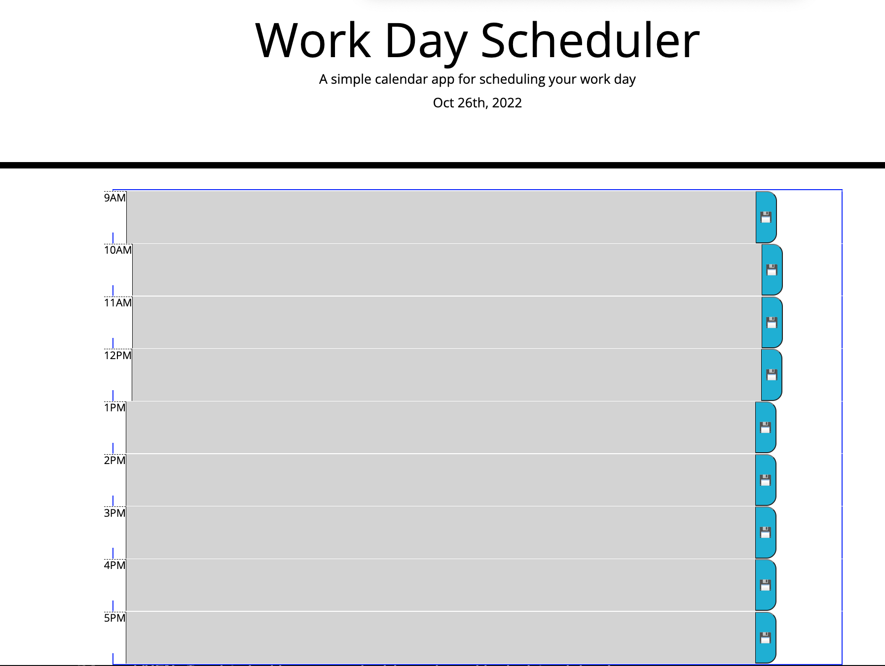

# Third-Party APIs: Work Day Scheduler

### Description: 
I made this work day scheduler to allow users to document their regular tasks based on the time schedule from 9am - 5pm. Using this project I learned the capabilities of how javascript helps in coding. 

# Built With: HTML, CSS and Javascript
# Getting Started: Open the website
# Prerequisites: N/A
# Installation: 
You should be able to access it on any browser.

# Usage: 
when they first load in on the work day scheduler, users are able to see saved events previously documented from local storage. Users are able to delete and replace their desriptions with new data. When the time passes the colors change to grey in the past, red is present and green is future text areas.

Contact: atsheridan38@gmail.com or 
Acknowledgments

https://github.com/WittyInventor/WorkDayScheduler

